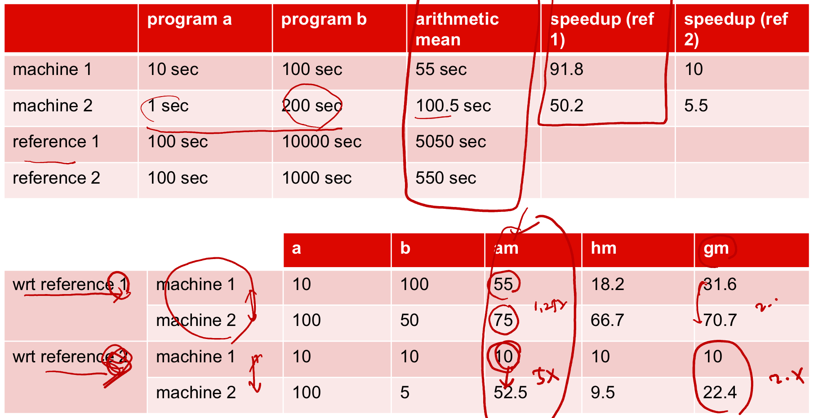
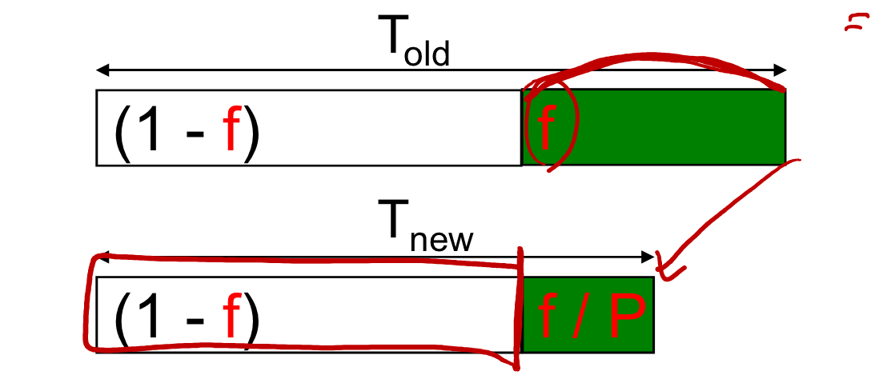
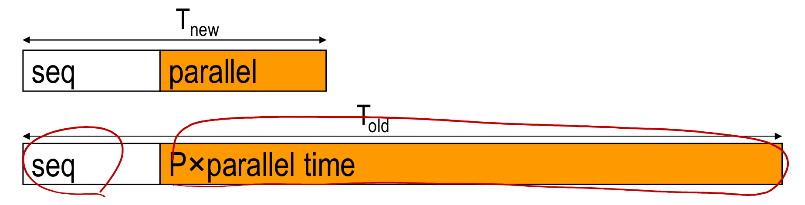

# lecture 3

#### computer performance

latency

-   time to execute a task
-   high-percentile reponse time

throughput

-   jobs per minute
-   average excuterate

#### CPU performance

execution time = seconds/program
$\frac{instructions}{program} * \frac{cycles}{instruction} * \frac{seconds}{cycle}$

$\frac{instructions}{program}$

-   determined by programmer/algorithm used
-   ISA / compiler

$\frac{cycles}{instruction}$

-   determined by system architecture and microarchitecture

$\frac{seconds}{cycle}$

-   determined microarchitecture and pipeline depth
-   Circuit design/combinational length
-   technology

#### performance metrics

-   metric 1, time to complete a task (Texe, time - exec), measure of latency
    -   measures execution time, response time
    -   X is N times faster than Y means Texe(Y)/Texe(X) = N
-   metric 2, tasks per unit time, measure of throughput
    -   throughput/bandwidth 
    -   chip multi-processors can improve throughput, but not latency
-   Unreliable metircs
    -   millions instructions per second MIPS
    -   millions floating point operations per second MFLOPS

#### how to improve performance

reduce number of instructions for a program
reduce the clock period/increase frequency or clock rate

$\frac{seconds}{program} = \frac{cycles}{program} \frac{seconds}{cycle}$

#### performance related metrics

a program will require some number of

-   instructions
-   cycles
-   seconds

vocabulary of metrics used to relate these quantities

-   cycle time (seconds per cycle)
-   clock trate (cycles per second)
-   CPI
    -   cycles per instruction
    -   floating point intensive application might have a higher CPI

#### performance calculations

two implementions of the same ISA

-   A clock cycle time 10ns and CPI 2.5
-   B clock cycle time 20ns and CPI 1.0
    -   B is faster because one instruction takes 20ns vs 25ns for A
    -   B is $\frac{5}{4}$ faster than A

two code sequences for a machine, with 3 different instruction classes. Class A B C, requiring 1 2 3 CPI respectively

-   first code sequence with 5 instructions 2A, 1B, 2C
-   second code sequence with 6 instructions 4A. 1B, 1C
    -   second code sequence is faster $4*1+1*2+1*3=9$ vs $2*1+1*2+2*3=10$ for the first sequence

two compilers, machine operating at 100MHz with 3 instruction classes, same as above

-   first compiler's code uses 5M class A instructions 1M class B and 1M class C
-   second compiler's code used 10M class A, 1M class B, 1M class C
    -   first code sequence is faster $5*1+1*2+1*3=10$ vs $10*1+1*2+1*3=15$ for the second sequence

#### effective CPI

average number of cycles per instruction 

$\text{overall effective CPI}=\sum_{i=1}^{n}CPI_i * IC\%$

overall effective CPI varies by instruction mix

-   a measure of dynamic frequency of instructions across one or many programs

#### effective CPI example

| OP     | FREQ | CPI  | MUL  |
| ------ | ---- | ---- | ---- |
| ALU    | 50%  | 1    | 0.5  |
| load   | 20%  | 5    | 1.0  |
| store  | 10%  | 3    | 0.3  |
| branch | 20%  | 2    | 0.4  |

$\text{overall effective CPI}=0.5+1.0+0.3+0.4=2.2$

##### how much faster would the machine be if a better data cache reduced the average load time to 2 cycles?

| OP   | FREQ | CPI  | MUL  |
| ---- | ---- | ---- | ---- |
| load | 20%  | 2    | 0.4  |

$\text{overall effective CPI}=0.5+0.4+0.3+0.4=1.6$

$\frac{2.2}{1.6}=1.375 \text{ times faster}$

##### how does this compare with using branch prediction to shave a cycle off the branch time?

| OP     | FREQ | CPI  | MUL  |
| ------ | ---- | ---- | ---- |
| branch | 20%  | 1    | 0.2  |

$\text{overall effective CPI}=0.5+1.0+0.3+0.2=2.0$

$\frac{2.2}{2.0}=1.1 \text{ times faster}$

not as good of an improvement

##### what if two ALU instructions could be executed at once?

>   not sure, assuming it means ALU CPI -> 0.5

| OP     | FREQ | CPI  | MUL  |
| ------ | ---- | ---- | ---- |
| ALU    | 50%  | 0.5    | 0.5  |

$\text{overall effective CPI}=0.25+1.0+0.3+0.4=1.95$

$\frac{2.2}{1.95}=1.128 \text{ times faster}$

not as good of an improvement

#### evaluating ISAs

design metrics, how long it takes to implement
static metrics, how densely can you store a program in memory 
dynamic metrics

-   how many instructions are executed
-   how many bytes does the processor fetch to execute a program
-   CPI 

best metric, time to execute the program

#### benchmarking

can use lots of types of programs

-   real programs
-   kernels
-   toy benches (ex. quicksort)
-   synthetics
-   benchmark suit

#### reporting performance

summarizing a benchmark with a single number

could use wieghted arithmetic mean of execution times

-   $\sum_{i}T_i*W_i$
-   programs with long execution times dominate the result
-   ie outliers can skew view of performance

must be able to reproduce result

-   report OS, compiler/settings, inputs, clocks etc

measureing speedup vs reference machine

-   speed up measures the advantage of a mchine over a reference for a program i
-   geometric mean used for comparison
    -   $\prod_{i}T_i^{1/n}$
    -   arithmetic mean influenced by chose of reference
-   independent of chosen reference
-   not good metric for total execution time

#### Amdahl's law

law of diminishing returns

$$
\frac{1}{(1-f)+\frac{f}{P}}
$$

-   speed up the most common case
-   $\text{speedup}=\frac{\text{Perf}_{new}}{\text{Perf}_{old}}=\frac{\text{T}_{old}}{\text{T}_{new}}$

example
-   floating point instructions are improved to run 2 times faster but only comprise 10% of the total instructions, what is the observed speedup?

$$
\begin{align*}
f&= 0.1; P=2\\
\text{speedup}&=\frac{1}{(1-f)+\frac{f}{P}} \\
&= \frac{1}{(1-0.1)+\frac{0.1}{2}} \\
&= \frac{1}{0.9+0.05} \\
&= \frac{1}{0.95} \\
&= 1.053
\end{align*}
$$

#### gustafson's law

$\text{old workload} = \text{seq} + P*\text{parallel time}$

$\text{new workload} = \text{seq} + \text{parallel time}$

$\text{speedup} = \text{seq} + P*(1-\text{seq})$

if the sequential time decreases with increased problem size, the speedup approaches P

#### power dissipation

##### dynamic 

$$
\begin{align*}
\frac{energy}{transition}&=C_LV_{DD}^2P_{0 -> 1} \\
power&=C_LV_{DD}^2f \\
\end{align*}
$$

C\_L is the capacitive load
V\_DD is the source voltage
P\_(0 -> 1) is the probabillity of the signal switching, also known as activity factor
f is the switching frequency

##### short circuit

$$
\begin{align*}
\frac{energy}{transition}&=t_{sc}V_{DD}I_{peak}P_{0 -> 1} \\
power&=t_{sc}V_{DD}I_{peak}f \\
\end{align*}
$$

t\_sc is the time the transistor is short circuiting during the switch
V\_DD is the source voltage
I\_peak is the peak current load
P\_(0 -> 1) is the probabillity of the signal switching, also known as activity factor
f is the switching frequency

#####overall power and energy

$$
\begin{align*}
E&=C_LV_{DD}^2P_{0 -> 1} + t_{sc}V_{DD}I_{peak}P_{0 -> 1} + V_{DD}I_{leak} \\
f_{0 -> 1} &= P_{0 -> 1}f_{clock} \\
P&=C_LV_{DD}^2f_{0 -> 1} + t_{sc}V_{DD}I_{peak}f_{0 -> 1} + V_{DD}I_{leak} \\
\end{align*}
$$

V\_DD \* I\_leak represents the leakage power

dynamic power makes up roughly 40-70% of the total today, and its percentage of the total is decreasing
short circuit power ~10%, absolute is decreasing
leakage power is ~20-50% and is increasing

#### efficieny

power in Watts

-   design constraint
    -   processor can only work fast enough to max out the power delivery or cooling solution 
-   peak power requirements
    -   determins power/ground circuit design
    -   sets packaging/cooling limits
    -   impacts signal/noise margin 

energy in Joules

-   defines the "true" cost of performing a fixed task
    -   combination of time and efficiency $E= P*t$

example

processor A consumes 1.2x power of processor B, but finishes in 30% less time. which is more energy efficient and by how much?

$$
\begin{align*}
P_b &= 1; t_b = 1 \\
P_a &= 1.2; t_a = 0.7 \\
E_b &= P_b * t_b \\
&= 1 * 1 \\
&= 1 \\
E_a &= P_a * t_a \\
&= 1.2 * 0.7 \\
&= 0.84 \\
\frac{E_b}{E_a} &= \frac{1}{0.84} = 1.19 \\
\end{align*}
$$

processor A is 1.19 times more efficient than proccessor B
