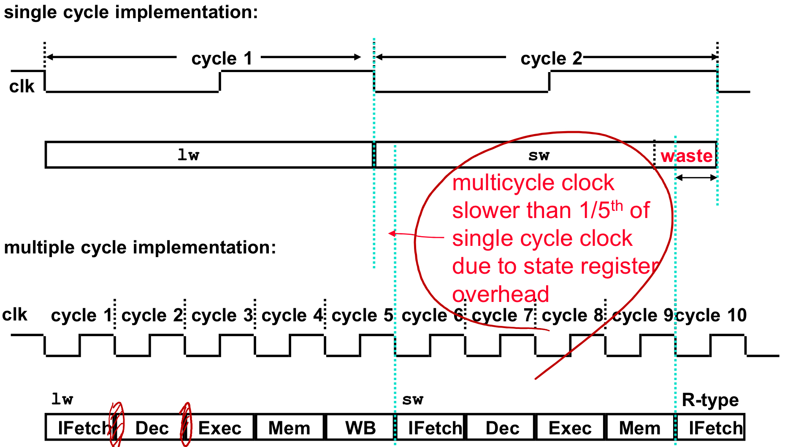

# lecture 4

#### clocking methodologies

defines when signals can be read/written to

-   typically edge triggered

typical paths consist of state elements with combinational logic short enough to resolve in the clock cycle

-   read contents of state element
-   pass through combinational logic
-   write to next state elements

assumes no write control logic, introduce additional signals to conditionally update state elements

#### MIPS

##### designing datapath

-   contains all elements that process data and in addresses in the cpu
    -   registers, ALU's, mux's, etc..

fetching instructions

-   read instruction from memory
-   update pc

decoding instructions

-   send instruction register's opcode and function bits to control logic

executing R format instructions

-   perform operation described by op+funct on values R[rs], R[rt]
-   store result into R[rd]
-   explicit control signal for saving register file

executing load and store operations

-   compute memory address
    -   add base address by adding base register to sext(imm16)
-   store value from specified register into this address
-   load value from address into specified register

executing branch operations

-   compare operands read from register file during decode
    -   ie if ALU outputs 0
-   compute branch target address 
    -   add updated pc to sext(imm16 << 2)

executing jump instructions

-   replace lower 28 bits with (imm26 << 2)

##### combining parts to make a single datapath

combine datapath segments and add control lines + multiplexors as needed

to ensure **single-cycle** design: fetch, decode, execute each instruction in **one** clock cycle

-   no datapath resource can be used more than once per instruction
    -   some elements must be duplicated
    -   spearate instruction & data memory, multiple adders

cycle time (frequency) is determined by the length of the longest combinational path

-   path must resolve to concrete value within the cycle

##### adding control logic

module that uses the current opcode to sets the relevant control signals to the correct values

-   due to single-cycle per instruction, no need to track state

#### instruction type vs number of required cycles

 Ifetch

-   instruction fetch
-   update PC

decode

-   instruction decode
-   register read
-   signextend offset

execute

-   execute R type
-   calcuate memory address
-   branch comparision
-   branch and jump completion

memory read

-   memory write completion
-   R-type instruction register file write

write back

-   memory read completion 
-   register file write

Depending on the instruction this can take between **3 to 5 cycles**

#### single-cycle architecture analysis

disadvantages

-   uses clock cycle inefficiently
    -   must be long enough to support the slowest instruction
    -   really bad for things like FP multiply
-   wasteful
    -   functional units are duplicated
    -   design block cannot be used twice during the same cycle

advantages

-   simple
-   easy to understand

#### multi-cycle datapath approch

let an instruction take more than 1 clock cycle to complete

-   break up instructions into steps where each step takes 1 cycle
-   balance work done in each step
-   restrict each cycle to only use one major functional unit
-   not every instruction takes the same number of clock cycles

implications

-   faster clock rates
-   functional units can be reused
    -   still only once per clock cycle (ie different clock cycles)
-   only need one memory (only one memory access per cycle)
-   only need one ALU/adder

at the end of the cycle

-   store result of step in register buffer at that point in the pipline
    -   not visible to programmer
    -   put here so functional unit can be reused on next step without losing the value from the first step
    -   load on every cycle
        -   no additional combinational logic required to drive write control
-   data used by subsequent instructions are stored in programmer visible registers
    -   ie instruction results are placed into IR, PC, Regfile

#### multi-cycle control logic

multi-cycle datapath control signals are not determined soley by the instruction

-   opcode can describe what the ALU operation should occur, but not when

requires internal FSM to manage each step of the instruction

#### multi-cycle architecture analysis

advantages

-   uses clock cycle efficiently
    -   clock rate is timed to accommodate the slowest instruction **step**
-   allows functional units to be used more than once per instruction
    -   must be on different steps/cycles

disadvantages

-   requires more registers
-   FSM control logic
-   more muxes

#### single-cycle vs multi-cycle timing

because of setup and hold times each clock cycle of the multi-cycle implementation is a little over $\frac{1}{5}$ the cycle time of the single-cycle implementation

#### critical path analysis

critical path is the chain of combinational logic that takes the longest time to resolve
defines the architecture's clock cycle time

|       | FETCH | DECODE R-READ | ALU  | PC update | D Memory | R-Write | Total ns |
| ----- | ----- | :----------------- | ---- | --------- | -------- | ------- | -------- |
| Add   | 1     | 1                  | 0.9  |           |          | 0.8     | 3.7      |
| Load  | 1     | 1                  | 0.9  |           | 1        | 0.8     | 4.7      |
| Store | 1     | 1                  | 0.9  |           | 1        |         | 3.5      |
| beq   | 1     | 1                  | 0.9  | 0.1       |          |         | 3.0      |

given the above table a single-cycle implementation has a $\text{clock cycle time} = 4.7ns + t_{setup} + t_{cq}$ due to the load instruction

would a multi-cycle implementation be faster?

-   can combine the ALU & PC update steps
-   longest of these 5 steps is 1ns
-   assuming $t_{setup} + t_{cq} = 0.1ns$
    -   $\text{single-cycle time} = 4.8ns$
    -   $\text{multi-cycle time} = 1.1ns$
-   instructions that require 3 or 4 steps are faster 3.3ns or 4.4ns
-   instructions that require 5 steps are slower 5.5ns
-   multi-cycle could be faster depending on the percentage composition of instruction

given the following instruction break down

|       | Cycles | Percentage |
| ----- | ------ | ---------- |
| Add   | 4      | 0.6        |
| Load  | 5      | 0.2        |
| Store | 4      | 0.1        |
| beq   | 3      | 0.1        |

$$
\begin{align*}
CPI &= 4*0.6+5*0.2+4*0.1+3*0.1\\
&= 4.1\\
\text{single-cycle TPI} &= 4.8ns\\
\text{multi-cycle TPI} &= CPI * 1.1ns\\
& = 4.1 * 1.1ns \\
&= 4.51ns
\end{align*}
$$

on average the multi-cycle implementation is 0.29ns faster per instruction

#### extreme example

assumptions

-   most instructions take 10ns
-   multiply instruction takes 40ns
-   multiply instructions make up 10% of all instructions
-   $t_{setup} + t_{cq} = 0ns$

how much faster is a multi-cycle implementation than a single-cycle implementation?

-   single-cycle instructions take 40ns
-   multi-cycle can use 10ns clock with 4 steps for a multiply instruction
    -   $\text{multi-cycle TPI} = (4 * 0.1 + 1 * 0.9) * 10ns = 1.3 * 10ns = 13ns$
-   multi-cycle is 27ns faster
    -   $\frac{40ns}{13ns} = 3.08$ times faster
