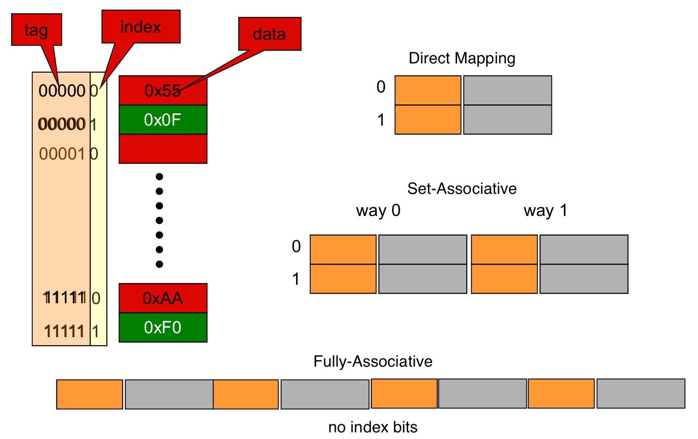

# lecture 5

#### types of memory

| Type           | Size       | Latency | Cost/bit |
| -------------- | ---------- | ------- | -------- |
| register       | < 1kB      | < 1ns   | $$$$     |
| on-chip SRAM   | 8kB - 6MB  | < 2ns   | $$$      |
| off-chip SRAM  | 1MB - 16MB | < 10ns  | $$       |
| DRAM           | 64MB - 1TB | < 100ns | $        |
| Disk (SSD, HD) | 40GB - 1PB | < 20ms  | < $1/GB  |

capacity is inversely proportionate to speed and cost

#### why does a hierachy work

locality of reference 

-   temporal locality
    -   reference same memory location many times (close together in time)
-   spatial locality
    -   reference near neighbors around the same time

#### example of locality 

>   huh? don't understand this slide

#### memory hierahcy

CPU <-> (instruction + data) L1 cache <-> shared L2 cache <-> L3? <-> main memory <-> disk

temporal locality

-   keep recently referenced items at higher cache levels
-   future references to these locations are satisfied quickly

spatial locality

-   bring neighbors of recent referenced locations to higherlevels
-   could be used bring instructions that could be used soon up to higher levels
    -   future references satisfied quickly

#### example Intel Nehalem memory hierarchy

-   4-way set associative instruction cache
-   8-way set associative L1 data cache 32kB
-   8-way set associative L2 data cache 256kB
-   16-way set associative L3 data cache 8MB
-   3 DDR3 memory connections

#### typical memory organization

use address to determine which row to access, then use address to decode which column to use

#### cache terminology

hit, requested data appears in the cache

-   hit rate, percentage time requested data is in the cache
-   hit time, time to acces the cache level, RAM access time and time to dertmine hit

miss, request data is not in cache level, must access lower level

-   miss rate, opposite of hit rate
-   miss penalty, time to replace a block in the upper level and deliver data to processor

hit time << miss penalty

#### average memory-access time (AMAT)

$$
\begin{align*}
\text{hit time}*\text{miss rate} &\approx 0 \\
\text{AMAT} &= \text{hit time}*(1-\text{miss rate}) + \text{miss penalty}*\text{miss rate} \\
&= \text{hit time} - \text{hit time}*\text{miss rate} + \text{miss penalty}*\text{miss rate}\\
&= \text{hit time} + \text{miss penalty}*\text{miss rate}\\
\end{align*}
$$

miss penalty

-   access time: function latency
-   transfer time: function of bandwidth bewteen cache levels
    -   transfer one cache line at a time
    -   transfer at the size of the memory-bus width

#### calculating memory heirarhcy performance

example

-   cache hit, 1 cycle
-   miss rate = 0.1
-   miss penalty, 300 cycles

$\text{AMAT} = 1\text{ cycle} + 0.1 * 300\text{ cycles} = 31\text{ cycles}$

#### reduce AMAT by using a multi-level cache

example

|            | miss rate | hit cycles |
| ---------- | --------- | ---------- |
| L1         | 0.1       | 1          |
| L2         | 0.05      | 10         |
| L3         | 0.01      | 20         |
| M (memory) |           | 300        |

$$
\begin{align*}
\text{AMAT} &= L1_{hit} + L1_{miss}*(L2_{hit} + L2_{miss}*(L3_{hit} + L3_{miss}*(M_{hit}))) \\
&=1 + 0.1*(10 + 0.05*(20 + 0.01*(300))) \\
&=2.115
\end{align*}
$$

AMAT substantially faster than the single level Implementation

-   $\frac{31}{2.115} = 14.66$ times faster

#### types of caches

| types of cache         | Cache memory to data mapping                           | cache search complexity                       |
| ---------------------- | ------------------------------------------------------ | --------------------------------------------- |
| direct mapped (DM)     | data only has one possible location it could be placed | very fast lookup/indexing mechanism           |
| set-associative (SA)   | data can be placed in any cachline in the set          | slightly more involved search mechansim       |
| fully-associative (FA) | data can be placed in any cachline in the entire cache | requries very extensive search hardware (CAM) |

