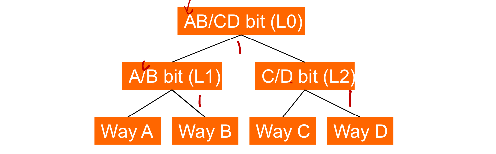
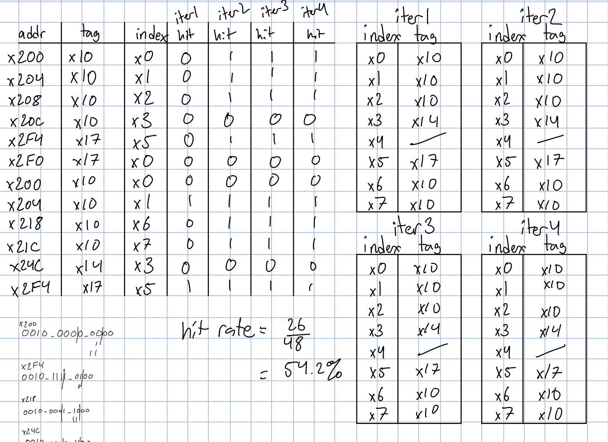

# lecture 6

#### replacement policies for associative caches

least-recently-used LRU

-   evict the line that was used least recently
-   need to keep track of order of use
-   overhead gets worse as associativity increase

random

-   pick a line at random
-   really easy to implement
-   slightly lower hit rates than LRU on average

not most-recently-used

-   randomly evict a line that is not the most recently used
-   only need to track the line most recently used
-   comprise hit rate and implementation difficulty

virtual memories

-   dicussed later

#### LRU precise tracking

requires a stack for each cache set

-   when processor access a cache line
    -   take line id from stack and place on top
-   when evicting use the bottom of the stack, represents the LRU cache line

example, 4-way set associativity, A B C D

-   access pattern: C D A B A C B D
-   assuming stack is initially empty, [-,-,-,-]
    -   [C,-,-,-] D A B A C B D
    -   [D,C,-,-] A B A C B D
    -   [A,D,C,-] B A C B D
    -   [B,A,D,C] A C B D
    -   [A,B,D,C] C B D
    -   [C,A,B,D] B D
    -   [B,C,A,D] D
    -   [D,B,C,A]

given S-way associativity the stack requires $S\log_2S$ registers

#### LRU example

assume all valid initally

|          | MRU  | MRU-1 | LRU+1 | LRU  |      |
| -------- | ---- | ----- | ----- | ---- | ---- |
|          | A    | B     | C     | D    |      |
| access C | C    | A     | B     | D    | hit  |
| access D | D    | C     | A     | B    | hit  |
| access E | E    | D     | C     | A    | miss |
| access C | C    | E     | D     | A    | hit  |
| access G | G    | C     | E     | D    | miss |

#### LRU hardware perspective

state machine associated with LRU registers, used to update stack

lru policy increases cahce access times

-   additional hardware bits needed for LRU state machine

#### LRU approximate tracking (pseudo-LRU)

LRU stacks very expensive to implement at high 'S'

most modern caches use approxiate LRU

-   popular approach uses S-1 bits
    -   blocks divided into binary tree
    -   one bit is used to track the MRU branch at each level
    -   requires less hardware than a true LRU
    -   faster than true LRU
-   example 4-way set associative cache
    -   block divided into 2 halves each with 2 lines
    -   first bit tracks which half was MRU, second and third bit track which block in the half is MRU 

#### pseudo-LRU example

4-way set associative cache

-   O(N) 3 bits 

**update algorithm** 

given LRU register = [L2, L1, L0] = [0, 0, 0], what does the LRU register look like after a hit to cache line B

| line hit | L2 (C-0 D-1) | L1 (A-0 B-1) | L0 (AB-0 CD-1) |
| -------- | ------------ | ------------ | -------------- |
| A        |              | 0            | 0              |
| B        |              | 1            | 0              |
| C        | 0            |              | 1              |
| D        | 1            |              | 1              |

after the access to line B the LRU register would be [0,1,0]

**replacement algorithm**

given LRU register = [0,1,0], what line should be evicted if a miss occurs

| L2 (C-0 D-1) | L1 (A-0 B-1) | L0 (AB-0 CD-1) | evict line |
| ------------ | ------------ | -------------- | ---------- |
|              | 1            | 1              | A          |
|              | 0            | 1              | B          |
| 1            |              | 0              | C          |
| 0            |              | 0              | D          |

should evict line D

-   between AB and CD, AB has been used more recently
-   between C and D, C has been used more recently

#### another example

given a 4-way set associative cache

-   access pattern C D A B A C B D
-   LRU register is in the form [AB/CD, A/B, C/D], [L0, L1, L2] from the diagram above

LRU register starts as [-, -, -]

-   [1, -, 0] D A B A C B D
-   [1, -, 1] A B A C B D
-   [0, 0, 1] B A C B D
-   [0, 1, 1] A C B D
-   [0, 0, 1] C B D
-   [1, 0, 0] B D
-   [0, 1, 0] D
-   [1, 1, 1]

what if a replacement occured after C D A B A C ? what line would be evicted

-   LRU register at this point: [1, 0, 0]
-   between AB and CD, CD had been used more recently
-   between A and B, A had been used more recently

in this case we would evict line B

-   a **true** lru would have picked D

#### true vs pseudo LRU review

-   true lru
    -   expensive in terms of speed and requiste hardware
    -   need to remember access pattern for all S lines
    -   O(S!) possible senarios 
    -   $S\log_2S$ required bits
-   pseudo lru
    -   approximates lru
    -   uses binary mru tree to determine evictions
    -   O(S)
    -   $S-1$ required bits

#### sample replacement policy question

-   byte addressable computer has a 32-byte cache with 4-byte cache lines
    -   when a given program is executed the processor reads data from the following sequence of hex addresses
    -   0x200, 0x204, 0x208, 0x20C, 0x2F4, 0x2F0, 0x200, 0x204, 0x218, 0x21C, 0x24C, 0x2F4
    -   pattern is repeated 4 times

show the contents of the cache at the end of each pass throughout the loop if a DM cache is used, compute hit rate. assume the cache is initially empty

given 32-bytes total, with 4-byte cache lines, and a DM cache, there must be 8 cache line

becuase each cache line hold 4-bytes, 2 bits must be used as offset

because there are 8 cache lines, 3 bits must be used for indexing

#### another question

consider a 256 byte 2-way set associative write back cache with 16-byte blocks and LRU replacement

-   assume the cache starts empty

complete the following table
