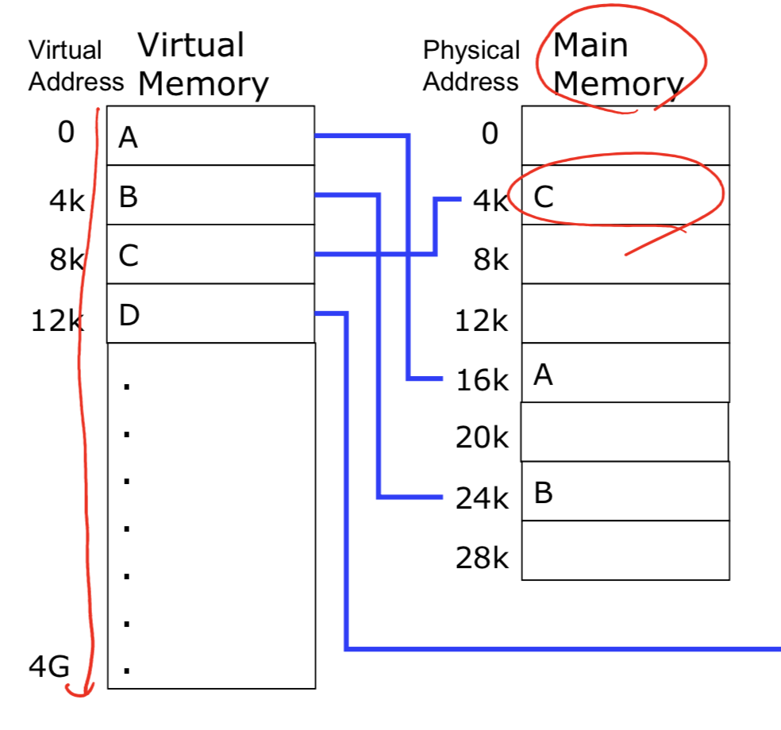
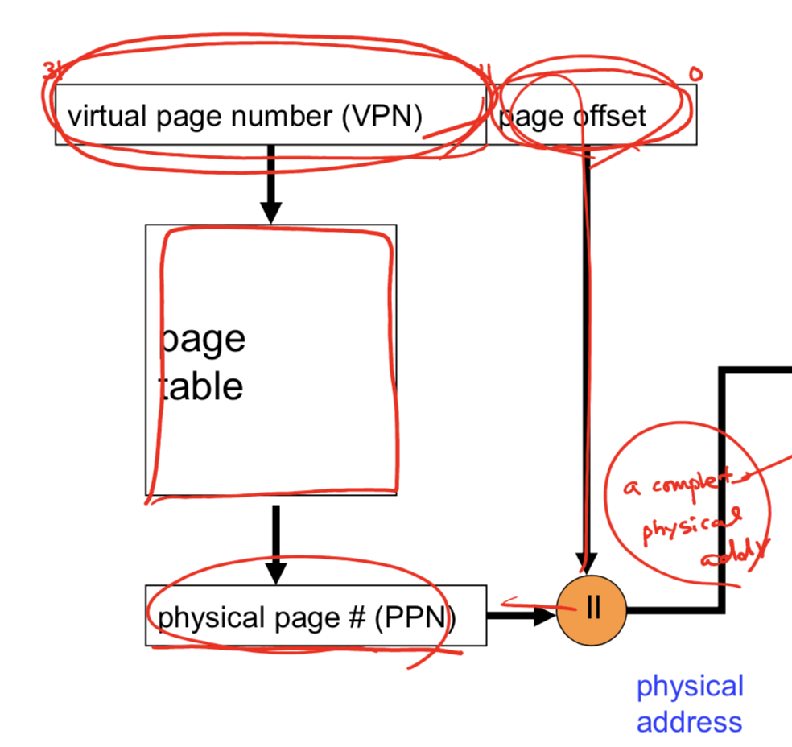
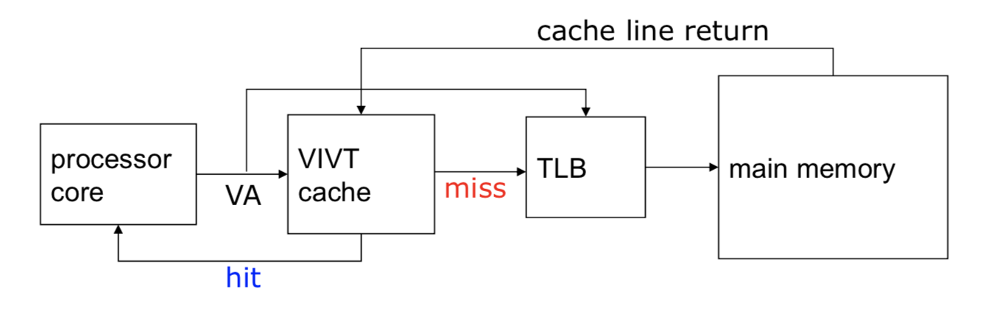
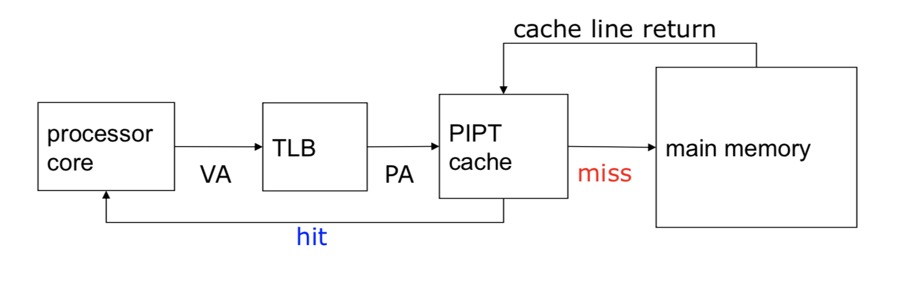
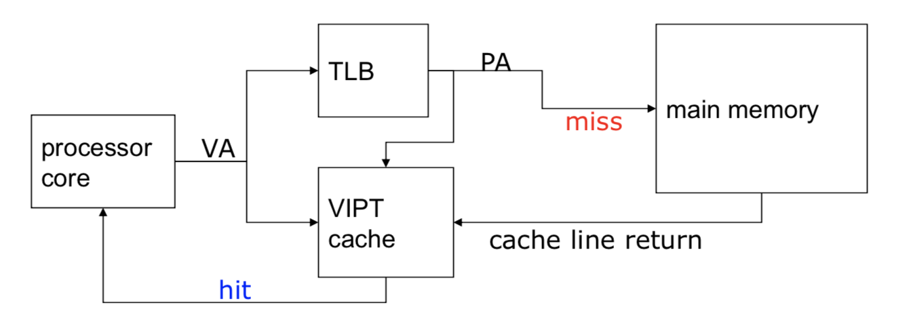
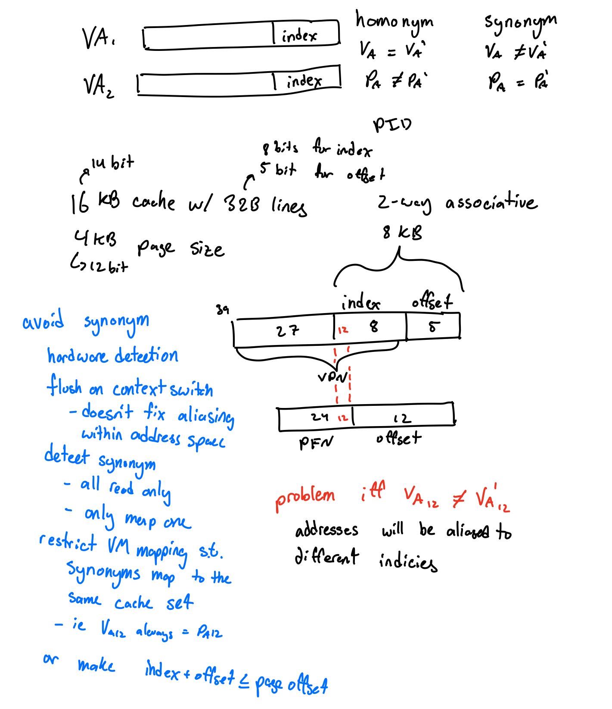

# lecture 7 notes

#### review: replacement policies

lru

- evict the least recently used
- larger overhead, gets worse as associativity increases

random

- easy, lower hit rates than true lru

not mru

- Randomly pick not the mru
- unecessarily complex

virtual memories

- use similar policies but spend more effor to improve hit rate

#### review: psuedo lru

- already know this

#### virtual memories

indirection between physical memory and logical memory

- the entire program does not need to be in memory concurrently
  - the logical address space can be much larger than the true physical address space
- allows memory regions to be shared by multiple processes/threads
- more efficient process creation

can be implemented through

- demand paging
  - segment memory into pages, only load them as needed
- demand segmentation
  - !!not sure what this is

#### virtual address

virtual address space that is bound to a physical address space

- virtual address, generated by cpu
- physical adress, true address in memory

virtual/physical addresses

- same at compile time
- differ at runtime

#### advantages of virtual memory

- translation
  - program gets the space address accross runs, but can map to different physical memory locations
  - !!only the most important part of the program "working set" must be in physical memory
  - continguous structures, like stacks, use only as much physical memory as needed, but can grow as needed
- protection
  - different threads/processes are protected from each other
  -  different pages can have different access paterns, ie read only, hidden from user programs etc
  - kernel data is protected from user programs
- sharing
  - map the same physical page to multiple users, share common libraries accross programs so multiple copys do not have to be in memory concurrently

#### virtual vs physical address

example the stack forms a contiguous address space, from the perspective of the program, however the physical memory backing it can/will be scrambled/disjoint

#### paging

frame

- divide physical memeory in fixed sized blocks, like 4KB

pages

- divide logical memory into blocks of the same size
- if a program needs n pages, we need to find n free frames and load the program into them
- set up a page table to map page addresses (virtual address space) to frame addreses (physical address space)
  - os sets up page table

#### address translation

virtual address is potentially larger than the physical address, if the frame size is 4KB and the memory is byte addressible, then the bottom $log_2(4KB) = 12 \text{ bits}$ are ignored and the upper bits are translated to a physical frame.

#### page table structure examples

multiple possible mapping schemes

one-to-one mapping

- large pages
  - internal fragmentation, similar to large cacheline sizes
- small pages
  - page table size issues, not enough space to store the table
  - 64 bit address space, 4KB pages, -> 12 bits used as offset, $2^{52}$ pages, if each entry requires 4 bytes to store then the size of the table is $2^{54}$ = 16 Petabytes, which is far too large to store

mutli-level paging

- given 3 levels of indirection, with the same setup, we have 4 pages each with $2^{13}$ entries each, so the overall size of memory required to store the tables is $ 4*(4*2^{13}) = 2^{17} =$ 128 Kilobytes

#### handling a page fault

reference a page not in memory 

1. page faults are handled by OS service routines
2. locate desired memory on disk
3. find a free frame and swap the data into it
4. reset the page table, set valid bit on entry
5. restart instruction that caused fault

#### fast address translation

used a translation lookaside buffer

- i-tlb and d-tlb
- essentially a cache, where the tags are the virtual page number and the data array is the physical page number
- fairly small with only 32 to 256 entries typical
- usually fully associative

#### context switches

each process has its own address space so each one has it's own page table

- page table entires are only relevant for a particular process/pid
- so the TLB must be flushed between switches
  - adds to the cost of switches

#### alternatives to flushing

use an address space ID to determine if a tlb entry is valid to a particular process

- address space ID, valid bit, ready only, modified

#### hard vs soft page faults

hard page fault

- page faults that require a read from secondary memory

soft page faults

- page faults where the page is in main memory but the TLB and/or page table entry has marked the page as invalid
- soft faults are used when the hardware cannot handle TLB misses

#### caches and virtual memories

do we send virtual or physical addresses to the cache

- virtual address to cache, no translation requires
  - secrutity issues as processes can share virtual addresses
  - requires flushing cache every context switch
- 4 possibilities
  - VIVT: virtually-indexed, virtually-tagged
  - PIPT: physically-indexed, physically-tagged
  - VIPT: virtually-indexed, physically-tagged
  - PIVT: physically-indexed, virtually-tagged

#### virtually-indexed, virtually-tagged

very fast cache accesses

- only requires translations when going to memory

issues, aliasing

- homonym
  - same virtual addresses map to different physical addresses for different processes
  - Occurs when there is a context switch
  - solution is to include PID in cache
    - could flush the cache on switches, expensive
- synonym (also in VIPT)
  - different virtual addresses map to the same physical addresses
  - occurs when data is shared by multiple processes
  - get duplicated cache lines in VIPT and VIVT w/ PID
  - data is inconsistent due to duplicated locations in the cache
  - solution
    - can write-through solve the problem?
      - No?
    - flush cache upon context switch
    - if (index+offset) < page offset, can the problem be solved? (discussed laterin VIPT)

#### physically-indexed, physically-tagged

- slower, all cache accesses require address translations
- much simpler for data coherence

#### virtually-indexed, physically-tagged

- gain the benefit of VIVT and PIPT
- parallel access to TLB and VIPT cache
- no homonym because the physical address is used as the tag
- still have synonym problem

#### handle synonym in VIPT

