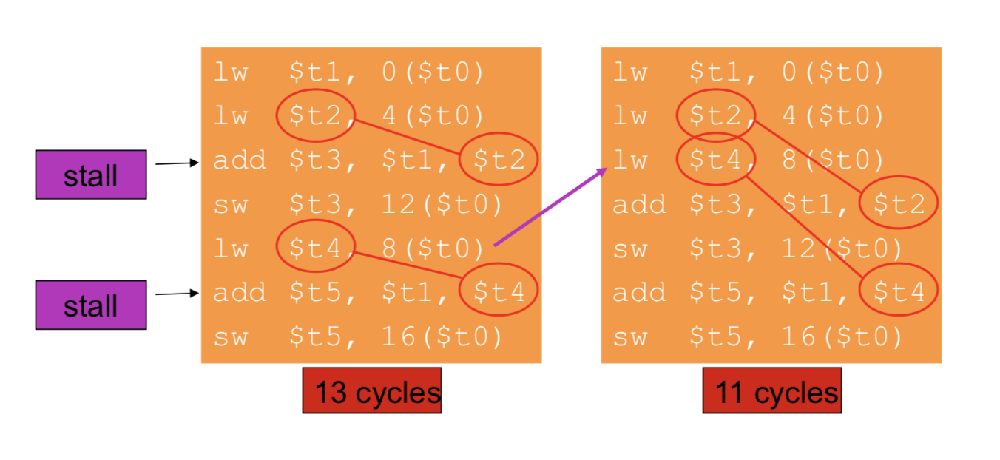

# lecture 8 notes

#### pipeline throughput computation

assume stages are perfectly balanced

!! time between instructions
- speed up of a pipelined processor = non-pipelined / # of stages

#### example 1

a processor that takes 5ns to execute an instruction is pipelined into 5 equal stages, the latch between each stage has a delay of 0.25 ns

- what is the minimum clock cycle time of the pipelined processor?
  - originally takes 5ns, spilt that into 5 for each of the stages and add the latch delay, $\frac{5ns}{5} + 0.25ns = 1.25ns$
- what is the maximum speedup that can be achieved by this pipeline processor?
  - $\text{speed up} = \frac{5ns \text{ per instruction}}{1.25ns \text{ per instruction}}= 4$
- can we have much deeper pipelining?
  - if we use 10 stages whats the speedup?
  - $\frac{5ns}{10} + 0.25ns = 0.75ns$, speed up = $\frac{5ns \text{ per instruction}}{0.75ns \text{ per instruction}}= 6.67$
  - as the pipeline deepens the latch delay becomes the limiting factor

#### example 2

a non-pipelined processor takes 5ns to execute an instruction. if I want clock the processor at 2GHz, how many stages should I pipeline this processor into if each latch has a 0.25ns delay?

$\text{cycle time} = \frac{\text{second}}{2,000,000,000\text{ cycles}} = 0.5ns$
$\frac{5 ns}{0.5 ns - 0.25 ns} = \frac{5 ns}{0.25 ns} = 20 \text{ stages}$ 

- what is the maximum speed up that can be achieved by the pipelined processor running at 2GHz? (compared to the original single cycle processor)
  - $\text{speed up} = \frac{5ns \text{ per instruction}}{0.5ns \text{ per instruction}}= 10$
- what is the average latency of an instruction?
  - !! learn this, maybe its just num stages * clock period?, in this case it would be $20*0.5ns = 10ns$ 
- how many stages if I want to clock the processor at 5GHz?
  - $\text{cycle time} = \frac{\text{second}}{5,000,000,000\text{ cycles}} = 0.2ns$
  - impossible, clock period is shorter than the latch delay


#### hazards

situtations that prevent starting the next instruction on the next cycle

- structural
  - a required resource is busy (alu, cache, etc)
- data
  - required value has not been made accessible yet
- contol
  - deciding what happens depends on a preview instruction

##### data 

a result is needed in the pipeline before it is available

```assembly
add R2, R1, R0
add R3, R2, R6 // <- this instruction requires R2 to be updated by the previous instruciton before it can execute (RAW hazard)
```

##### branch

Should be branching but cannot determine this until further down into the pipeline, so the next couple instructions start execution when they should not

##### software handling

insert nops such that the required values are available for the next instruction

##### hardware handling

stall dependent stages and fetches as needed "insert bubbles", essentially hardware insertion of no-ops in the middle of the pipeline as needed

##### stalls

to make sure the pipeline functions correctly with register dependencies, we need to

- Detect the hazard
- stall the pipeline
  - stall the IF and ID stages
  - insert no-ops into later stages

#### register scoreboard

track availibilty of each register with a bit

- add a valid bit
- set false when instruction that modifies that register is in flight
- set true when the instruction completes
- stall upcoming instructions that depend on invalid registers

#### forwarding

forward from the ex/mem and mem/wb register the ex stage, if a dependence exists bewteen where they are writing and the registers the instrucion in id/ex requires

- double data hazard

```assembly
add R1, R1, R2
add R1, R1, R3
add R1, R1, R4
```

both hazards occur, we want to only forward the most recent write to R1

- loads

need to introduce a bubble to wait for the value returned from memory

#### example 

```assembly
add R3, R2, R1
lw R4, 100(R3)
and R6, R4, R3
sub R7, R6, R2
```


#### code scheduling to avoid stalls


