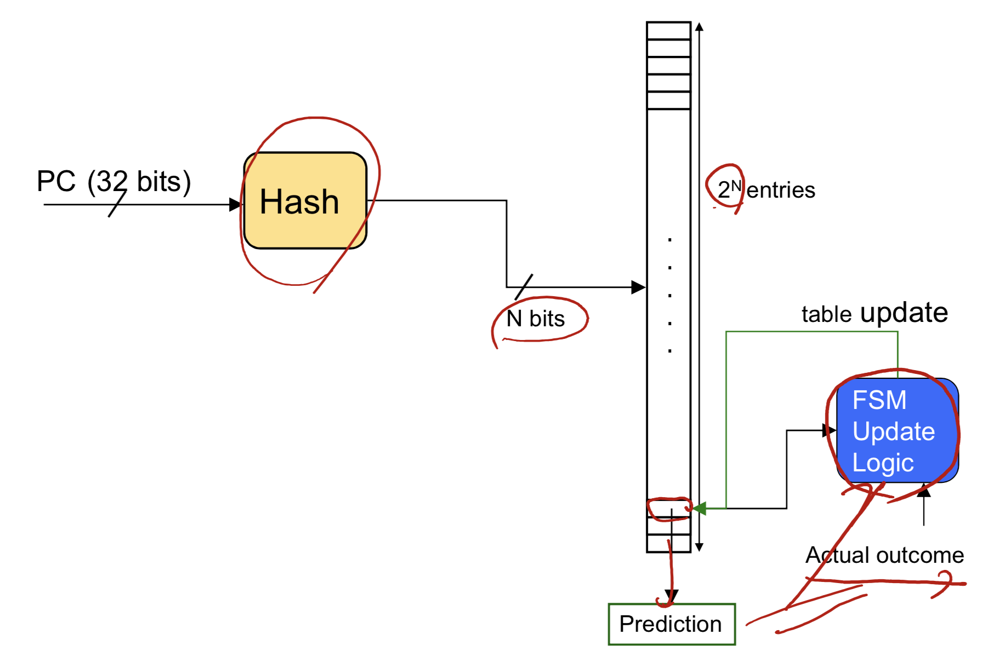
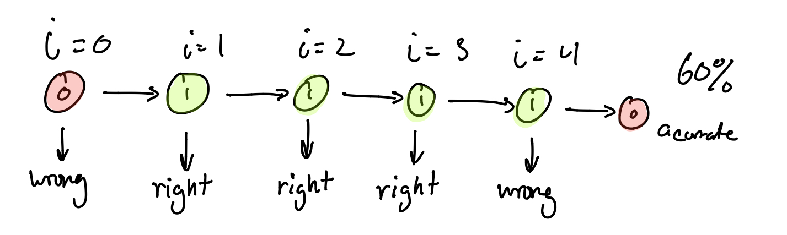
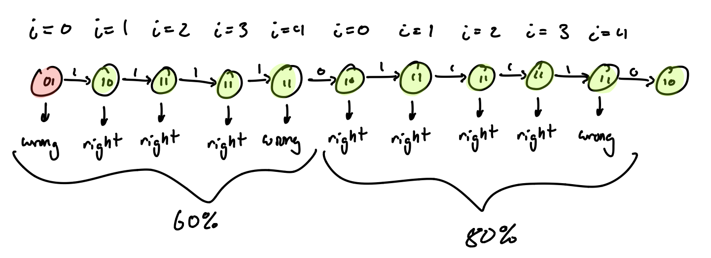
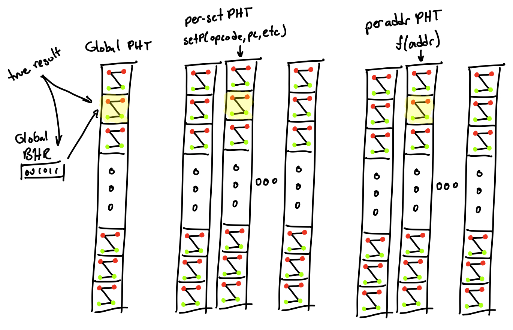
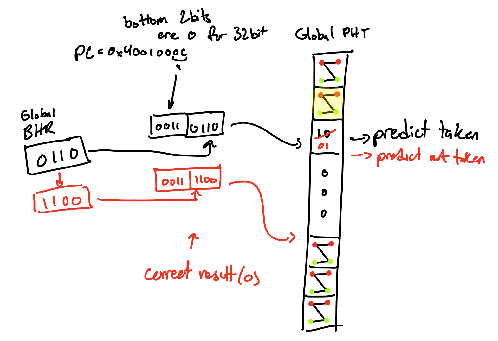
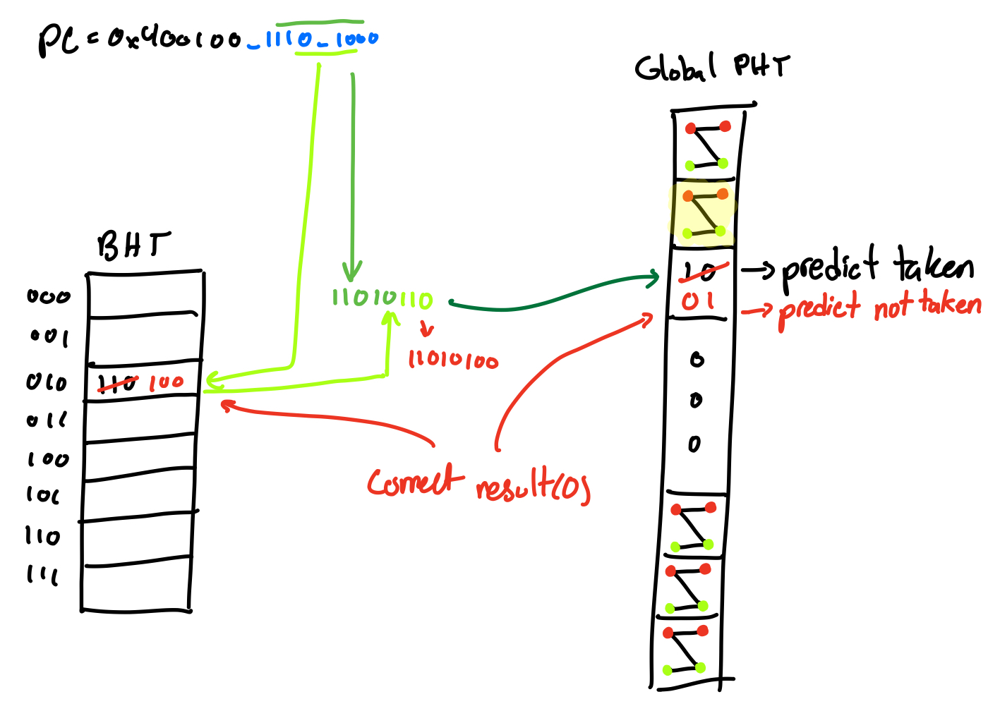
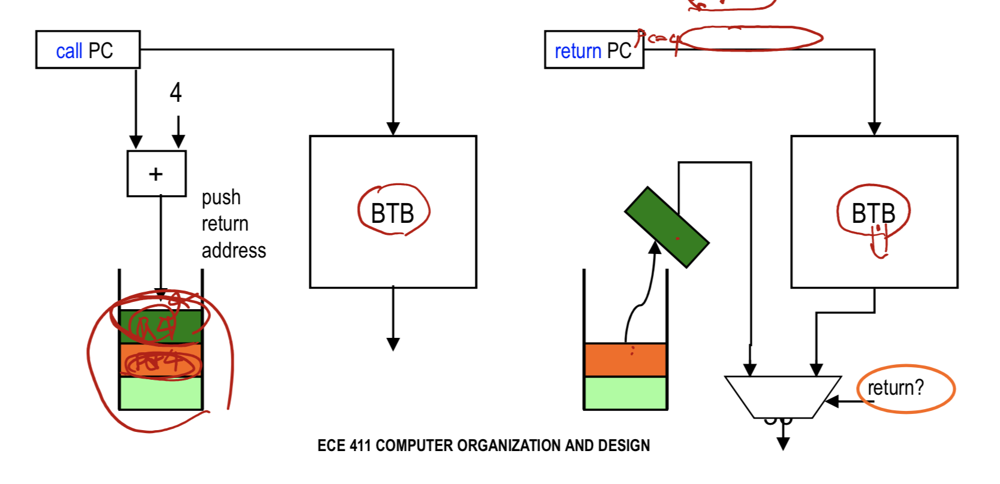

# lecture 9 notes

#### branch hazard resolutions

1. stall until branch direction is clear
2. static branch prediction
   - predict fallthrough
     - execute successor instructions in sequence
     - “squash” instructions in pipeline if branch actually taken
   - predict taken
     - but haven’t calculated branch target address
     - might incur 1 cycle branch penalty
     - other machines: branch target known before outcome
3. dynamic branch prediction
4. delayed branch
  - insert an instruction from elsewhere in the program to run after the branch
  - ensure the chosen instruction does not effect the excution of the program


#### delayed branch

##### filling slot from before

```assembly
/* original */
add R1, R2, R3
if R2 = 0 -> jmp target
	//delay slot    
target:

/* converted */
if R2 = 0 -> jmp target
	add R1, R2, R3    
target:
```

##### filling slot from target

```assembly
/* original */
target: sub R4, R5, R6
add R1, R2, R3
if R2 = 0 -> jmp target
//delay slot

/* converted */
target:
add R1, R2, R3
if R2 = 0 -> jmp target
sub R4, R5, R6
```

##### filling slot from fall-through

must ensure the chosen instruction will not be used in the target path before redefinition

```assembly
/* original */
add R1, R2, R3
if R2 = 0 -> jmp target
//delay slot
or R7, R8, R9
target: sub R4, R5, R6

/* converted */
add R1, R2, R3
if R2 = 0 -> jmp target
or R7, R8, R9
target: sub R4, R5, R6
```

#### branch prediction

- direction
  - single direction for unconditional jumps/calls&returns
  - binary for conditional branches
- target
  - one: uni-directional jumps
  - two: fallthrough vs taken
  - many: function point or indirect jump

#### simplest dynamic branch predictor

typical table organization



- prediction based on latest outcome
- index by some bits in the branch PC
  - aliased

#### 2-state machine (1-bit)

- state 0, predict not taken
- state 1, predict taken
- changes to other state based on true outcome

```c
for (i=0; i<4; i++) {
    //...
}

for (i=0; i<4; i++) {
    //...
}
```



#### 4-state machine (2-bit)

- strongly/weakly taken
- strongly/weakly not taken

strongly taken <-> weakly taken <-> weakly not taken <-> strongly not taken

```c
for (i=0; i<4; i++) {
    //...
}

for (i=0; i<4; i++) {
    //...
}
```


#### two-level branch predictor

generalized correlated branch predictor

- 1st level tracks branch history in BHR, branch history register
- 2nd level tracks pattern history in PHT, pattern history table

##### branch history register

n-bit register, implies the PHT has 2^n entries 

- (left) shift in branch outcomes
  - 1 taken, 0 not taken
- can be: global, per-set, local/per-address

##### pattern history table

addressed by BHR

- each entry keeps a 2 or more bit counter for predictions
  - can be initialized in alternating pattern
- alias/interfence problem

#### global history schemes



##### glopal history per set/address



##### per address history



#### btb operation

- use all of the pc bits for lookup
  - match implies theres a branch
- if match and predict bits == taken
  - set PC to predicted PC
- if prediction is wrong, must recover in the same ways as before
- if branch instruction without BTB entry
  - can look up prediction now and act
  - or can just predict not taken
- when branch is resolved update the btb

truely just a cache with pc as the input address

#### indirect jumps/return

- branch predictor does really well with conditional jumps
- btb does really with will unconditional jumps, JMP JSR etc
- indirect jumps often change for the same instruction so directly using a btb doesnt work well
  - usually used for return instructions
- Procedure calls and returns
  - Always taken, calls address always known
  - Return address almost always known
- return address stack (RAS)

#### return address stack

may not know it is a return instruction prior to decoding

- rely on btb for speculation, fix once recognize return 



#### calculating the cost of branches

many factors

- frequency of branch instructions (every 4-6 instructions)
- correct prediction rate
  - 1-bit: ~80% to 85%
  - 2-bit: ~80s to 90%
  - correlated branch prediction: ~95%
- misprediction penalty, some number of cycles
- misfetch penalty
  - correct prediction but do not know the target address yet

#### example 1

What is the probability that a branch is taken?

- 20% of branches are unconditional branches
- of conditional branches,
  - 66% branch forward
    - evenly split between taken & not taken
  - the rest branch backwards
    - are almost always taken

$ 0.2 + 0.8*( 0.66*0.5 + (1-0.66)*(0.99) ) = 0.73328 $

#### example 2

What is the contribution to CPI of conditional branch stalls, given:

- 15% branch frequency
- a BTB for conditional branches only w/o 10% miss rate
  - 3-cycle miss penalty
  - 92% prediction accuracy (no stall on hit)
  - 7 cycle misprediction penalty
- base CPI is 1

$\text{CPI contribution} = 0.15 * (0.1 * 3 + 0.9*(0.92 * 0 + 0.08 * 7)) = 0.1206$
